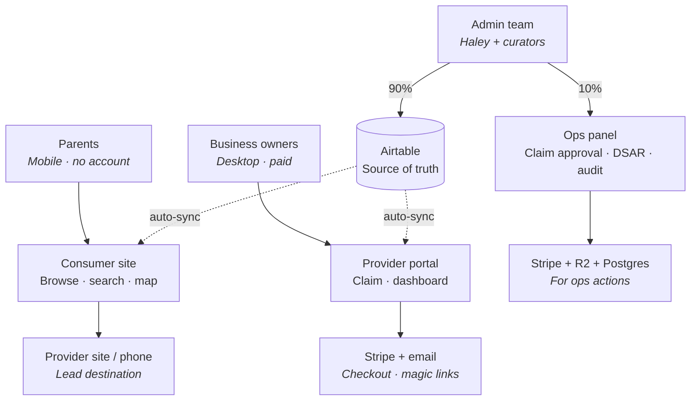

# Foundra — working doc

> Living understanding doc. Add to this as the picture sharpens.

---

## What it is

A curated local kids-activity directory. Free for parents to browse; paid for businesses who want visibility, listing control, and lead-tracking analytics. Launching in Palm Beach County, architected from day one to scale to 100+ markets without rebuilding.

**Business model.** Two-sided marketplace, Yelp / TripAdvisor-style. Parents discover free; businesses subscribe for visibility and lead analytics. No booking, no transactions through the platform — discovery + click-out + lead-gen visibility is the entire value prop. Founding-tier-with-spots-counter is the urgency play that pre-sells subscriptions before consumer traffic is fully built up (the chicken-and-egg solve, made possible because 600–1,200 listings are already curated upstream).

---

## How users interact with the platforms



**Three user types, each with a primary surface plus supporting touchpoints.** Only the admin column has a structural exception — two parallel surfaces (Airtable 90%, custom Ops panel 10%).

- **Parents are account-free in v1.** Discovery + click-out is the entire consumer side. No sign-up, no inquiry forms, no booking.
- **Business owners use three touchpoints**: the provider portal (main), Stripe (hosted Checkout + customer portal), email (magic links + dunning).
- **Admin team works primarily in Airtable** (90% — listings CRUD, override flags, founding-tier counter, editorial work). The custom Ops panel exists only for workflows Airtable can't orchestrate: claim approval (anti-fraud + Stripe customer creation), DSAR / right-to-erasure, audit log viewer, white-glove "act as operator" impersonation.
- **Airtable edits auto-propagate** to the consumer site + provider portal via the sync layer. No deployment cycle for editorial changes.
- **Postgres + Algolia back all three surfaces** but are never directly touched by any user.

---

## Engineering feature map

Comprehensive view of the meaningful engineering surfaces in v1, organized by component. The two features Haley flagged for the interview — **production search/filtering** and **bidirectional Airtable ↔ Postgres sync with webhook reliability** — sit in the *Consumer site* and *Sync layer* sections respectively. The rest is context.

### Consumer site (Next.js, mobile-first)

- Region-scoped URL routing: `/[region]/[category]/[listing-slug]`, region resolved server-side
- ISR with on-demand revalidation triggered by Airtable webhooks (editorial changes go live without a deploy)
- Instant search + faceted filters powered by Algolia
- URL-synced filter state, deep-linkable and sharable
- Filter relaxation on zero results — fallback queries, soft constraints via `optionalFilters`, category-suggestion matching
- Sort variants via Algolia replicas (relevance, newest, distance, alphabetical)
- Mapbox map view with clustered pins; full filter parity between list and map
- Skeleton / empty / error states on every async surface
- `schema.org` JSON-LD per page (LocalBusiness + appropriate subtypes, generated from a versioned source-of-truth→schema.org mapping doc)
- Dynamic OG images via `@vercel/og`
- Favicons + PWA manifest, installable, bottom tab nav on mobile
- Sitemap, region-aware, auto-regenerated on Airtable change
- Click-tracking (Visit website + Call) feeds operator stats dashboard
- Favorites via `localStorage` (no account required in v1)
- Analytics (PostHog or Plausible); Sentry for error tracking
- Lighthouse 90+ on mobile, Core Web Vitals in "Good", sub-2s load on 4G
- Cookie consent banner, "Do Not Sell My Info" link (CCPA), accessibility statement page
- WCAG 2.1 AA — automated Axe/Lighthouse + manual keyboard/screen-reader audit

### Provider portal (Next.js, desktop-first)

- Magic-link authentication: passwordless, session-based, account recovery
- 3-field pre-payment claim form (lowest friction before money changes hands)
- Stripe Checkout (hosted): two tiers + annual toggle, founding-tier badge with live spots-remaining counter
- Stripe Tax handles multi-state automatically
- Timestamped Operator Agreement + Consumer ToS acceptance at checkout
- Multi-step onboarding wizard with progress indicator
- Save-and-resume across sessions / days / weeks, state persisted to Postgres
- Operator-owned-fields-only enforcement — UI doesn't expose pipeline-owned fields at all
- Photo gallery (up to 8 images, drag-to-reorder), browser-direct upload to R2 via signed URLs, type/size/dimension validation, virus scan before commit
- Structured CRUD for programs/offerings
- Preview-before-publish mode for every edit
- 30-day operator stats: page views, search appearances, click-throughs, calls (the lead-gen value prop)
- Embedded Stripe customer portal for billing self-service
- Idempotent form submissions

### Ops panel (custom admin UI — thin operational layer)

- Claim approval queue with anti-fraud signals (IP patterns, email patterns, repeat addresses, rate-limit breaches)
- Subscription drill-down with Stripe actions (refund, cancel, plan change)
- Live revenue dashboard (MRR, churn, founding-tier spots remaining)
- Audit log viewer — filterable by actor / action / date / target, diff per change
- DSAR handler — export everything across Postgres + Airtable + Stripe + R2 + logs for a given user email
- Right-to-erasure execution — hard-delete cascade across all systems
- Per-account data export (CSV / JSON)
- White-glove "act as operator" impersonation — session takeover, all actions audit-logged
- Hidden URL honeypot management (anti-scraper config)

### Airtable (source of truth + primary admin workspace)

- Editorial CRUD on all listings — Haley's team lives here for ~90% of admin work
- Schema with explicit pipeline-owned vs. operator-owned field separation
- Provenance columns at the schema level (`created_at`, `updated_at`, `change_log`, `source_of_change`)
- Webhook publishing on record change drives the sync layer
- Airtable Interfaces for prettier dashboards (moderation review, founding-tier overview) without custom code
- Bulk operations native to Airtable

### Postgres / Supabase (operational mirror + app data)

- Schema mirror of Airtable, denormalized where it helps query performance
- Provenance columns enforced at the write layer
- App-only tables not in Airtable: claims, Stripe customers, sessions, audit log, click-tracking events, image metadata, sync state, dead-letter queue, save-and-resume onboarding state
- Service-role access only — no row-level security relied upon, boundary is server-side route handlers
- Region-scoped query indexes
- Supabase backup + point-in-time recovery
- 90-day retention for transient tables (click events, sessions)

### Algolia (search index — single index, region-scoped)

- Single `listings_prod` index, `region_slug` as `filterOnly` facet (multi-tenancy via filter, not index-per-region — scales to 100+ markets cleanly)
- `tier` as `customRanking` signal — Founding > Premium > Tier 1 > unclaimed (encodes the monetization signal directly into ranking)
- `attributesForFaceting`: category, age range, indoor/outdoor, price tier, neighborhood
- `searchableAttributes` ordered by weight (name > tags > description)
- Replicas for sort variants (newest, alphabetical, distance)
- `optionalFilters` for soft constraints (powers filter relaxation)
- Typo tolerance + synonyms management
- Downstream-only: Postgres → Algolia, never written from Airtable directly (failure isolation)

### Sync layer (cross-cutting workstream — built throughout v1, not a discrete phase)

- Bidirectional Airtable ↔ Postgres:
  - Airtable → Postgres: webhook → signature verification → idempotent upsert
  - Postgres → Airtable: API call with sync-token in metadata field for echo-loop prevention
  - Echo recognized via sync-token and short-circuited at the inbound handler
- Idempotency keys per change (record ID + revision + field hash)
- Exponential-backoff retry on transient failures
- Dead-letter queue for permanent failures, with admin review surface
- Nightly full-scan reconciliation as the backstop
- Field-level ownership enforcement at the write layer (eliminates co-owned races by design)
- Conflict resolution: last-write-wins with provenance tracked, only for true co-owned fields (designed to be ~zero)
- Direction-agnostic infrastructure — anticipates the Postgres-as-SoT flip in 12–24 months as a config change, not a rewrite

### Image pipeline (Cloudflare R2)

- Signed upload URLs — browser uploads directly to R2, no server passthrough
- Type / size / dimension validation (client + server)
- Virus scanning before final commit
- CDN-fronted delivery via Cloudflare
- Metadata in Postgres (filename, size, dimensions, scan status, ownership)
- Per-operator quota enforcement

### Stripe integration

- Hosted Checkout (no PCI exposure)
- Stripe Tax for multi-state sales tax automation
- Customer portal embedded in operator dashboard
- Webhook handlers with signature verification (subscription lifecycle, invoice events)
- Dunning sequence on failed payments (days 1 / 3 / 7)
- Abandoned-claim event firing to CRM for recovery
- Refund / plan-change actions surfaced in the Ops panel
- Founding-tier spots-locked-during-checkout pattern — prevents double-allocation under concurrent claims

### Email (transactional)

- Magic-link delivery (claim verification, returning sessions, account recovery)
- Dunning sequence (days 1 / 3 / 7 for failed Stripe payments)
- Receipt emails (Stripe-delivered)
- Operator notifications (claim approved, listing live, monthly stats digest)
- SPF / DKIM / DMARC configured before first send

### Security, compliance, performance (cross-cutting)

- Cloudflare Pro: WAF, bot management, rate limiting, CDN
- CSP + full security header set
- Vercel env vars with rotation strategy
- Anti-fraud rate limiting on claim attempts + manual review queue
- Hidden URL honeypots (anti-scraper)
- 90-day server log retention
- GDPR / CCPA compliance — cookie consent, DSAR handler, right-to-erasure, portability via CSV/JSON export
- WCAG 2.1 AA — automated + manual audit
- Idempotent API operations across the board
- Per-route rate limiting at the application layer

### Testing & launch readiness

- End-to-end tests of critical flows (claim, search, dashboard edits, sync directions)
- Load test at 1,000 concurrent users target
- Automated security scan (Snyk / ZAP) with documented remediation
- OWASP Top 10 versioned checklist in repo
- Google Rich Results validation
- SEO checklist
- Backup restoration test
- Disaster recovery runbook reviewed
- Cooperation with independent security reviewer in final 1–2 weeks

### Documentation deliverables

- README (Day-1 onboarding for next dev)
- ADRs (architecture decision records, versioned)
- Data dictionary
- Field ownership matrix (pipeline vs. operator)
- Source-of-truth → schema.org mapping document
- OpenAPI for internal APIs
- Webhook documentation
- Runbooks for common incidents
- Deployment guide
- Monitoring / alerting documentation
- Future-developer onboarding guide

---

## Flagship feature deep dives

The two features Haley flagged in her interviewer note. Structured to be talked to, not read from.

### Production search & filtering

**Anchor: ONVC (Online Vacation Center) cruise-package search.** Production consumer search on Cloudflare Workers via OpenNext, Webflow CMS as upstream, Tailwind v4 + Headless UI for the UI. Hundreds of listings across **6 facet dimensions**: package type, cruise line, ship, destination, region, departure month, duration.

**Architectural decisions I owned:**

- Single SSR fetch of the full transformed dataset; all filtering / sorting / pagination on the client against a Zustand store. No per-interaction network latency.
- KV cache with 5-minute TTL, write-through on cold miss, backwards-compatible cache schema (handled a migration without downtime).
- Cold requests fan out to 5 Webflow lookup collections in parallel via `Promise.all`, joined into a denormalized `Listing[]` blob at the edge.
- URL-synced filter state in both directions: server reads `?destination=` / `?cruiseline=` / `?startdate=` on the SSR call, client writes back on every filter change. Marketing campaign links land users in any filtered view.
- Month-token coercion (`startdate` → `departureMonth`) and both camelCase + lowercase aliases for filter params — backward compatibility for legacy marketing URLs.
- Skeletons, empty states, load-more pagination, react-virtuoso for the long lists.

**Trade-offs I called explicitly:**

- Client-side filtering works *because* the dataset fits in one response. For 100k+ records, the right call is a search index — which is exactly what Haley made for Foundra.
- KV cache TTL is a deliberate trade between freshness and Webflow API load. 5 minutes was the sweet spot for that traffic profile.
- Cache schema versioning let me migrate without flushing — the legacy schema continued to deserialize until everything had rotated through.

**How I'd apply this to Foundra:**

- Single Algolia index `listings_prod`, `region_slug` as a `filterOnly` facet — multi-tenancy via filter, not index-per-region. Scales cleanly to 100+ markets.
- `tier` as a `customRanking` signal: `desc(tier_rank)` where Founding > Premium > Tier 1 > unclaimed. The monetization signal lives inside the search ranking, not as a post-process.
- `attributesForFaceting`: category (`searchable`), age range (`filterOnly`), indoor/outdoor, price tier, neighborhood.
- `searchableAttributes` weighted: `name` > `tags` > `description, category`.
- Replicas for sort variants: `listings_newest`, `listings_distance` (with geo sorting), `listings_alphabetical`.
- Filter relaxation strategy on zero results: drop filters in priority order — price → neighborhood → age range → category. Use `optionalFilters` for soft constraints where a partial match is acceptable. Pair with copy that's helpful: *"No exact matches for soccer for 13–17 in $-$ — here are 14 nearby options."*
- Sync direction: Postgres → Algolia only, on every change. Algolia is never written from Airtable directly — failure isolation.

**Honest framing:** I've shipped all the underlying patterns (faceting, filter relaxation, multi-tenant filtering, URL-synced state, ranking) at production scale. ONVC didn't need Algolia at that record count, so I've configured Algolia indices but not owned one end-to-end. The index design + sync worker for Foundra is day-one work — small ramp, not a gap.

---

### Bidirectional Airtable ↔ Postgres sync

**Primary anchor: Freight Expert.** Production insurance renewal microsite system for a US-based transportation insurance agency (~14-person team, thousands of leads). I own the architecture and the codebase.

- External SoT: FMCSA API + Zoho CRM
- Internal store: Supabase Postgres
- Field ownership enforced structurally; provenance per row; signed webhooks; idempotent upserts; async post-processing that fails independently; per-file recovery logs for partial failures

**Airtable-specific anchor: Rox Radar.** Maintained a production Airtable ↔ Webflow CMS sync via WhaleSync. Directly relevant operational experience with Airtable as a sync source — including the failure modes (rate limits, partial writes, schema drift, attachment URL expiry).

**How I'd structure the sync for Foundra:**

```
Airtable (SoT) ──[webhook]──► sync handler ──► Postgres ──► Algolia
                                                  ▲
Provider dashboard ──writes──► Postgres ──[API + sync-token]──► Airtable
```

**Direction 1 — Airtable → Postgres:**

- Airtable webhook fires on record change
- Handler verifies HMAC signature
- Idempotent upsert keyed by Airtable record ID
- Idempotency key = `record_id + revision + field_hash` — deduplicates retries cleanly
- On success → enqueue Algolia sync job

**Direction 2 — Postgres → Airtable:**

- Operator saves in dashboard → Postgres write
- Worker fires Airtable API PATCH with a UUID **sync-token** stored in a metadata field on the record
- When Airtable's webhook fires back with that same token, the inbound handler recognizes its own echo and short-circuits — *zero re-write loop, no state machine needed*

**Reliability primitives:**

- HMAC signature verification on inbound webhooks
- Exponential-backoff retry (3 attempts: 1s / 5s / 30s)
- Dead-letter queue: Postgres table + admin review surface in the Ops panel
- Nightly full-scan reconciliation as the backstop: scan Airtable, diff against Postgres, flag and replay deltas

**Field ownership at the write layer (the key idea):**

- Pipeline-owned fields (`address`, `lat`, `lng`, primary categories, region, claim status, moderation flags) can *only* be written by the Airtable sync path
- Operator-owned fields (`description`, `photos`, `hours`, `programs`, `tags`) can *only* be written by the dashboard path
- The dashboard's API surface literally doesn't expose pipeline-owned fields
- Result: **no co-owned fields by design → no last-write-wins races to resolve**
- If a true co-owned field becomes necessary later, the provenance columns (`updated_at`, `source_of_change`, `change_log`) handle it — last-write-wins with full audit trail

**Scale consideration at 100+ markets:**

- The bottleneck isn't Postgres, it's Airtable's API rate limits (5 req/s per base)
- Mitigation: per-region Airtable bases (sharding) + queue-based ingestion buffer between webhook and Postgres write
- Webhook back-pressure handling via the queue depth

**Direction-agnostic for the future SoT flip:**

The spec calls this out explicitly. Today Airtable is SoT, Postgres is the cache. In 12–24 months Postgres becomes SoT. The sync layer doesn't know which side is authoritative — it's a config flag. Flipping it is a config change in the sync infrastructure, not a rewrite. This is structurally how Freight Expert is already architected today.

**Honest framing:** I've shipped this exact pattern with FMCSA + Zoho. The Airtable webhook specifics — payload shape, rate limits, scope tokens — need a day of ramp-up. But the architecture and the failure modes I already know. Rox Radar gave me direct Airtable production experience including the operational pain.

---

## Load-bearing assumptions to verify with Haley

Four assumptions whose contradiction would meaningfully shift the architecture. Worth asking directly in the call rather than waiting for ambiguity to surface later.

### 1. Listing granularity — business or program?

> "Is a listing one business/venue (Boca Soccer Academy) with programs nested inside, or is each class/program its own searchable record? My working assumption is business-level with programs as a nested free-text structure — fits the 600–1,200 count and the curated framing. If parents need 'Tuesdays at 4pm for my 7yo' as a primary search axis, the data model flips to program-level."

If she says program-level: Algolia indexes programs not businesses, record count likely 5–10x larger, and search UX needs schedule-aware faceting.

### 2. Region structure — path or subdomain?

> "For 100+ markets at scale — when you add Miami-Dade, is it a separate subdomain (miami.foundra.com) or a path-based region (/miami-dade-county/)? My recommendation is path-based with a single Algolia index using `region_slug` as a filter. Much simpler to operate at 100 markets."

If she says subdomain: Vercel multi-domain routing, separate sitemaps per region, more DNS work, harder cross-region analytics.

### 3. Write authority — is the dashboard the only write path?

> "Is the operator dashboard the only place that writes back to Airtable for operator-owned fields like description, photos, hours, programs? Or does your team sometimes edit those directly in Airtable while operators edit through the dashboard? If only the dashboard writes, we get clean field ownership with zero runtime conflict resolution. If both can write, we need last-write-wins with provenance."

If she says both can write: there are real co-owned fields and the spec's conflict-resolution language becomes load-bearing rather than theoretical.

### 4. Schedule depth — v1 or v2?

> "For v1, are program schedules free-text on the listing page (e.g. 'Tuesdays 4–5pm, Sept–Dec'), or do parents structurally filter on schedule ('show me classes happening Saturday morning')? Structured recurring schedules with timezones and exceptions is a real complexity bump — happy to scope to v2 if it's not core to launch."

If she says structured: RRULE-style data model, schedule-aware Algolia indexing, calendar UI on the dashboard. Adds 1–2 weeks of v1 work.

### Lower-stakes questions to round out the call

- Pipeline cadence: does enrichment run continuously and overwrite, or once per listing with manual review after?
- Holding page email capture endpoint: existing CRM, Mailchimp, or custom?
- Editorial workflow: is Airtable Haley's day-to-day workspace, or did she envision a custom admin UI for listings management? (the scope-reduction conversation)

---

## Trial week scope

Part-time engagement, fixed deliverable, sits *before* the 8-week v1 build. Day 1 ships a real deliverable Haley keeps either way; Days 2–4 prototype the architecturally riskiest pieces; Day 5 produces decision-ready documentation.

### Day 1 — Monday
- Phase 0 holding page live in production (her actual Day-3 deliverable, hit on Day 1)
- Email capture wired to her chosen endpoint
- Design system loaded into a Next.js scaffold
- Cloudflare Pro configured (WAF, baseline bot rules, rate limits)
- Security headers, robots.txt, accessibility statement stub

### Day 2 — Tuesday
- Airtable schema review with Haley
- Propose Postgres mirror schema (field ownership map + provenance columns)
- Supabase project + initial migrations
- One-way sync prototype: Airtable webhook → signature verification → idempotent Postgres upsert (one record working end-to-end on her real data)

### Day 3 — Wednesday
- Algolia index design proposal (single index + region filter + `customRanking`)
- Sync worker: Postgres → Algolia on every change
- Reverse direction prototype: dashboard write path with sync-token echo prevention, proven on one operator-owned field
- HMAC signature verification on inbound Airtable webhooks

### Day 4 — Thursday
- Search prototype on her live data: 2–3 facet dimensions, URL-synced filters, listing detail page
- Mobile-first responsive layout from her design reference HTML
- Lighthouse 90+ on mobile
- Skeleton + empty states for the prototype

### Day 5 — Friday
- Architecture decision log (ADR-style, 5–8 decisions)
- Sync direction diagram + field ownership matrix
- Open questions log
- Week-2 plan with phase-by-phase build estimate

### What Haley keeps either way

- Working Phase 0 holding page in production
- Bidirectional sync prototype on her real Airtable
- Search prototype she can play with on her own data
- Architecture documentation she can show any future dev

The trial week is structured so even if she doesn't continue the engagement, she's net ahead by a working Phase 0 + sync proof + architecture proposal. Lowers her risk meaningfully.

---

## v1 phase breakdown (8-week build)

Six phases per the spec. Phase 4 (sync) is explicitly cross-cutting, not a discrete sprint — it touches Phases 1, 2, 3, and 5.

### Phase 0 — Holding page (Day 1)
Hit on Day 1 during the trial week, not Day 3. Email capture, security headers, design system, Cloudflare, robots.txt.

### Phase 1 — Public directory (Weeks 1–3)
The largest surface. Homepage, region/category/listing detail pages, Algolia-powered faceted search, Mapbox map view, schema.org JSON-LD (LocalBusiness + appropriate subtypes), dynamic OG images via `@vercel/og`, PWA manifest, sitemap, analytics, Sentry. The source-of-truth → schema.org mapping document is a Phase 1 deliverable.

### Phase 2 — Claim & payment (Weeks 3–4)
3-field pre-payment form, magic-link verification, Stripe Checkout (two tiers + annual), founding-tier spots counter, Stripe Tax, customer portal, signed webhooks, dunning sequence, abandoned-claim event to CRM, anti-fraud rate limiting + manual review queue, timestamped ToS + Operator Agreement acceptance.

### Phase 3 — Operator dashboard (Weeks 4–5)
Magic-link auth, guided onboarding wizard with save-and-resume, photo gallery upload (8 images, R2 direct, validation + virus scan), structured CRUD for programs, preview-before-publish, 30-day stats dashboard, embedded Stripe customer portal, account recovery.

### Phase 4 — Sync & cache layer (cross-cutting, Weeks 1–5)
Built throughout, not as a discrete sprint. Foundations start in trial week → expanded in Week 1 → field ownership locked by Week 2 → reconciliation + DLQ in Week 3 → polishing in Weeks 4–5 as Phases 2 and 3 stress-test the write paths.

### Phase 5 — Admin tools (Weeks 5–6)
Thinner than the spec reads (see scope-reduction observation #1). Claim approval queue, subscription overview + Stripe actions, revenue dashboard, audit log viewer, DSAR + erasure handlers, per-account export, honeypot config, white-glove "act as operator" impersonation.

### Phase 6 — Testing & launch readiness (Weeks 6–8)
End-to-end tests, load test at 1,000 concurrent, security scan + remediation, OWASP Top 10 checklist, accessibility audit (Axe + manual), Rich Results validation, SEO checklist, backup restoration test, DR runbook, full documentation set, independent security reviewer cooperation in final 1–2 weeks.

### Honest timing assessment

8 weeks is aggressive for full scope. Realistic v1: Phases 0–4 + most of 5 inside 8 weeks. Phase 6 deliverables that are *artifacts* (OWASP versioned checklist, manual WCAG audit, DR runbook polish, independent security review remediation) likely slide into the client's mentioned 30–60 day post-launch window. Worth surfacing the pushback explicitly — the spec itself says honest timeline pushback is welcomed.

---

## Page-level UX notes

Mobile-first across the consumer side. Desktop-first for provider dashboard and admin. Notes per key surface.

### Region home — `/palm-beach-county`
Sticky search bar at top. Hero with region name + tagline. Featured listings carousel (premium-tier). Category tiles grid (6–8 visible). "View on map" CTA. Bottom tab nav on mobile (Home / Browse / Map / Saved).

### Category page — `/palm-beach-county/soccer`
Header with category + count ("47 soccer programs in Palm Beach County"). Filter chip bar at top (Age, Indoor/Outdoor, Price, Neighborhood). Sort dropdown (Relevance / Newest / Distance). Result cards: photo, name, age-range badge, claimed-verified badge, distance. List/Map toggle. Load-more pagination.

### Search results — `/palm-beach-county/search?q=swimming`
Same shape as category page. Empty state with filter-relaxation suggestions ("No exact matches; here are 14 nearby alternatives"). Recent searches in localStorage.

### Listing detail — `/palm-beach-county/listing/[slug]`
Photo carousel hero (up to 8). Title, address, distance, age-range badge, claimed-verified badge. Description. Programs section with schedule text per program. Mapbox embed showing location. Primary CTA sticky on mobile: "Visit website" / "Call" (click-tracked). Save (heart icon). "Claim this listing" footer link if unclaimed. schema.org JSON-LD embedded.

### Map view — `/palm-beach-county/map`
Full-screen Mapbox with clustered pins. Filter bar at top (collapsible). Pin tap → preview card slides up. Tap preview → navigate to detail.

### Operator dashboard — `/dashboard` (desktop-first)
Left sidebar nav: Overview / Edit / Photos / Programs / Stats / Billing / Account. Overview = claimed listing card + key stats. Edit = form for operator-owned fields only. Photos = drag-to-reorder gallery with per-image upload status. Programs = structured CRUD. Stats = line chart of 30-day metrics. Billing = embedded Stripe customer portal. "Preview as parent" toggle in top bar.

### Claim flow — `/claim/[slug]`
See the existing unclaimed listing as displayed. 3-field form: business email, owner name, role. "Why claim?" trust copy (visibility, control, leads, founding-tier badge). Continue → Stripe Checkout → magic-link verification → onboarding wizard.

### Onboarding wizard (multi-step, save-and-resume)
Step 1: Verify basics (pipeline fields read-only with "request correction" link). Step 2: Photos. Step 3: Description. Step 4: Programs. Step 5: Preview & publish. Progress indicator at top. Can leave any time and come back.

### Ops panel — `/admin` (desktop-only)
Left sidebar: Claims / Subscriptions / Revenue / Audit / Compliance / Honeypots. Each surface is a thin operational tool (see scope-reduction observation #1).

---

## Scope-reduction observations

Senior-judgment moments worth surfacing in the interview when she asks "how would you approach the 8 weeks." These show you've read the spec critically rather than just nodding at it.

### 1. Admin panel ≠ full custom CMS
Phase 5 reads like "build an admin CMS." It doesn't have to be. Airtable IS the editorial workspace — Haley's team already lives there. The custom Ops panel is a thin operational layer for what Airtable can't do: claim approval (anti-fraud + Stripe customer creation), DSAR + erasure (cross-system orchestration), audit log viewer, white-glove impersonation, honeypot config. Probably 30–40% of the implied scope.

### 2. Field ownership at the write layer eliminates runtime conflict resolution
The spec mentions "conflict resolution (last-write-wins on co-owned fields with provenance tracked)." Structure the schema so pipeline-owned and operator-owned fields are completely disjoint and there are no co-owned fields by design — no last-write-wins logic at runtime, just provenance for audit. The spec's language applies to a degenerate case that shouldn't exist.

### 3. Search is account-free
No sign-up, no inquiry forms, no booking on the consumer side. Deliberate scope discipline — adding any of those means moderation, spam handling, response loops. Click-out + lead stats is enough to demonstrate provider value.

### 4. Algolia multi-tenancy via filter, not index-per-region
For 600–1,200 listings × 100+ markets, a single index with `region_slug` filter beats N indices on operational cost, sync simplicity, cross-region analytics, and Algolia pricing.

### 5. Sync is cross-cutting, not a phase
Phase 4 in the spec is explicitly a workstream. Foundation starts in trial week → grows alongside Phases 1, 2, 3 → polished by Week 5. Not a "Phase 4 sprint" with a clear start and end.

### 6. Phase 6 deliverables likely slide post-launch
OWASP versioned checklist artifact, manual WCAG 2.1 AA audit, DR runbook polish, independent security review remediation. Real deliverables that take real time. Realistic v1: Phases 0–4 + most of 5 inside 8 weeks; Phase 6 audit deliverables in the client's mentioned 30–60 day post-launch window. The spec says honest timeline pushback is welcomed.

### 7. Holding page on Day 1, not Day 3
Spec says Day 3 non-negotiable. A senior dev hits this Day 1. Sets a confidence-building tone before the architecture conversation even starts.

---

## Doc status

- [x] What it is + business model
- [x] How users interact with the platforms (interaction map)
- [x] Engineering feature map (12 component areas, ~120 features)
- [x] Flagship deep dives — production search & filtering, bidirectional Airtable ↔ Postgres sync
- [x] Load-bearing assumptions to verify with Haley
- [x] Trial week scope (Day 1–5)
- [x] v1 phase breakdown (Phase 0 through Phase 6)
- [x] Page-level UX notes
- [x] Scope-reduction observations

Doc is interview-ready. Add new sections above this status block as new questions surface.
